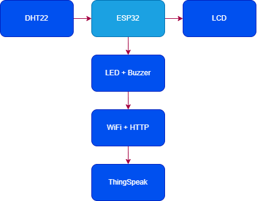
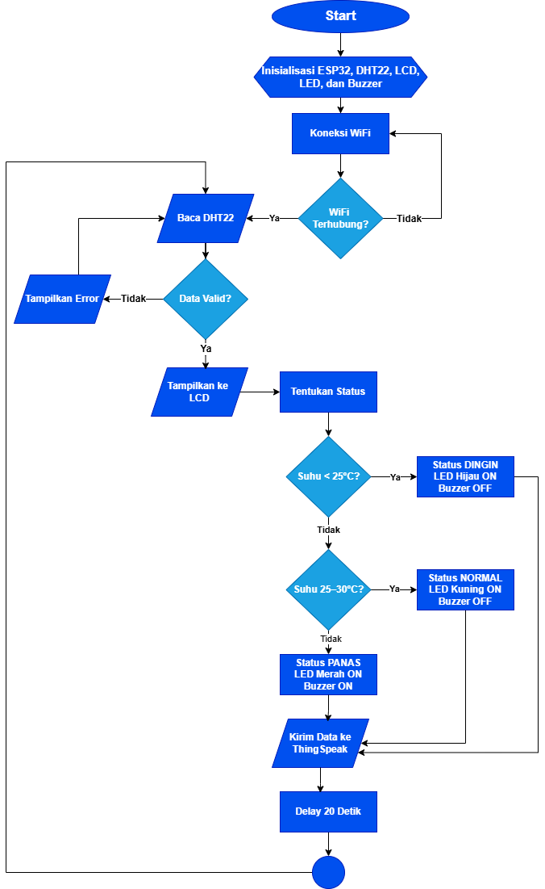
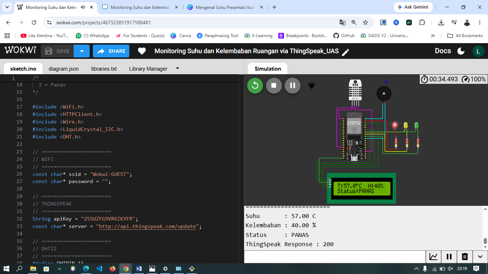
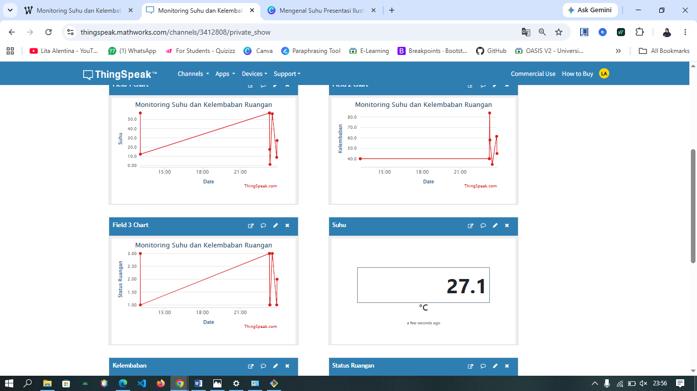

# Monitoring Suhu dan Kelembaban Ruangan via ThingSpeak

## Proyek Akhir Sistem Mikrokontroler

### Deskripsi

Proyek ini merupakan sistem monitoring suhu dan kelembaban ruangan yang menggunakan sensor DHT22 sebagai perangkat sensor (input), mikrokontroler ESP32 sebagai pengendali utama, serta LCD 16×2 dan aktuator berupa LED dan buzzer sebagai perangkat keluaran (output). Sensor DHT22 membaca nilai suhu dan kelembaban secara real-time, kemudian data diproses oleh ESP32 untuk ditampilkan pada LCD. Berdasarkan nilai suhu yang terdeteksi, ESP32 mengendalikan aktuator berupa LED dan buzzer sebagai indikator kondisi ruangan. Selanjutnya, data suhu, kelembaban, dan status ruangan dikirim ke platform ThingSpeak menggunakan protokol HTTP melalui koneksi WiFi sehingga dapat dipantau secara online dan real-time.

---

## Latar Belakang

Suhu dan kelembaban ruangan merupakan faktor yang memengaruhi kenyamanan manusia serta kondisi peralatan elektronik di dalam ruangan. Monitoring secara manual kurang efisien karena harus dilakukan secara langsung dan berkala.

Dengan memanfaatkan koneksi WiFi dan platform ThingSpeak, proses monitoring suhu dan kelembaban dapat dilakukan secara real-time melalui internet sehingga kondisi ruangan dapat dipantau dengan lebih mudah. Selain menampilkan data hasil monitoring, sistem juga mengendalikan aktuator berupa LED dan buzzer sebagai indikator kondisi ruangan sehingga pengguna dapat mengetahui kondisi ruangan secara langsung maupun melalui platform ThingSpeak.

---

## Tujuan

* Merancang sistem monitoring suhu dan kelembaban menggunakan sensor DHT22 dan ESP32.
* Menampilkan data sensor pada LCD secara real-time.
* Mengirim data ke ThingSpeak menggunakan protokol HTTP.
* Mengendalikan LED dan buzzer sebagai indikator kondisi ruangan.

---

## Hardware

* ESP32
* Sensor DHT22
* LCD I2C 16×2
* LED Hijau
* LED Kuning
* LED Merah
* Buzzer
* Resistor

---

## Software

* Wokwi Simulator
* ThingSpeak

---

## Protokol Komunikasi

**HTTP (Hypertext Transfer Protocol)**

HTTP digunakan untuk mengirimkan data suhu, kelembaban, dan status ruangan dari ESP32 menuju platform ThingSpeak melalui jaringan internet.

---

## Diagram Sistem

---

## Flowchart Sistem

---

## Hasil Simulasi

---

## Hasil Monitoring ThingSpeak

---

## Logika Program

| Suhu        | Status |
| ----------- | ------ |
| < 25°C      | Dingin |
| 25°C – 30°C | Normal |
| > 30°C      | Panas  |

### Indikator

| Status | LED    | Buzzer |
| ------ | ------ | ------ |
| Dingin | Hijau  | Mati   |
| Normal | Kuning | Mati   |
| Panas  | Merah  | Aktif  |

---

## Cara Kerja Sistem

1. ESP32 melakukan inisialisasi seluruh komponen.
2. ESP32 menghubungkan perangkat ke jaringan WiFi.
3. Sensor DHT22 membaca suhu dan kelembaban ruangan.
4. Data hasil pembacaan ditampilkan pada LCD.
5. ESP32 menentukan status ruangan berdasarkan nilai suhu.
6. LED dan buzzer bekerja sebagai indikator sesuai kondisi ruangan.
7. Data suhu, kelembaban, dan status ruangan dikirim ke ThingSpeak menggunakan protokol HTTP setiap 20 detik.
8. ThingSpeak menampilkan data monitoring dalam bentuk grafik secara real-time.

---

## Hasil Implementasi

Berdasarkan hasil pengujian, sistem berhasil bekerja sesuai dengan yang diharapkan, yaitu:

* Sensor DHT22 berhasil membaca suhu dan kelembaban ruangan.
* LCD berhasil menampilkan data secara real-time.
* LED dan buzzer bekerja sesuai logika program yang telah ditentukan.
* ESP32 berhasil mengirimkan data ke ThingSpeak menggunakan protokol HTTP.
* Data monitoring berhasil ditampilkan dalam bentuk grafik pada platform ThingSpeak.

---

## Kesimpulan

* Sistem monitoring suhu dan kelembaban ruangan berhasil dibuat menggunakan ESP32 dan sensor DHT22.
* Data hasil pembacaan sensor dapat ditampilkan pada LCD secara real-time.
* Data berhasil dikirim ke ThingSpeak menggunakan protokol HTTP melalui koneksi WiFi.
* LED dan buzzer berfungsi sebagai indikator kondisi ruangan berdasarkan nilai suhu.
* Sistem berjalan dengan baik pada simulator Wokwi.

---

## Author

**Lita Alentina**
**NIM:** 23552011097
**Kelas:** TIF K 23B
